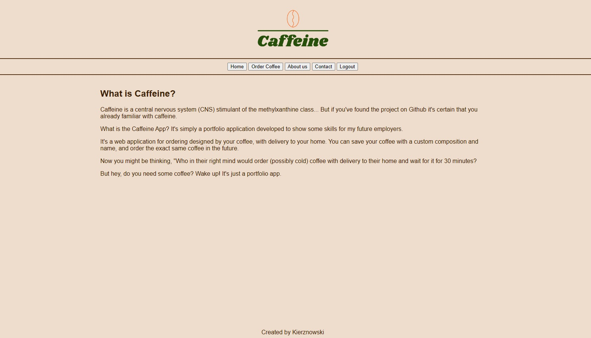
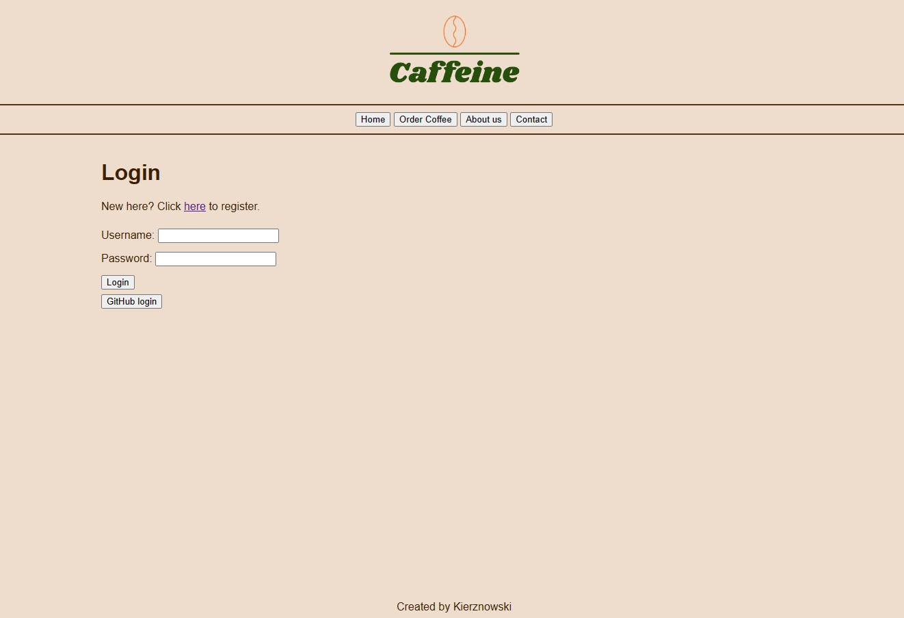

<h1>☕ Caffeine App ☕</h1>

Caffeine is a central nervous system (CNS) stimulant of the methylxanthine class... But if you've found the project on Github it's certain that you are already familiar with caffeine 😉

What is the Caffeine App? It's simply a portfolio application developed to show some skills for my future employers.
It's a web application for ordering designed by your coffee, with delivery to your home. You can save your coffee with a custom composition and name, and order the exact same coffee in the future.

Now you might be thinking, "Who in their right mind would order (possibly cold) coffee with delivery to their home and wait for it for 30 minutes?"
  But hey, do you need some coffee? Wake up! It's just a portfolio app.

 

Application in progress. Status for now: 
- ordering coffee form, 
- appending order for another coffees, 
- delivery data form,
- connection with database via SpringBootJPA,
- Login and registration
- Login via Github (OAuth2)
- Rest API (in progress)
- front-end (in progress)

 
<i>In folder <b>Other_Versions_For_Excercise</b> I'm adding (as the name suggests) other versions write for excercise purpose (e.g. connection with MongoDB instead of SQL db).
 

 

 

 

