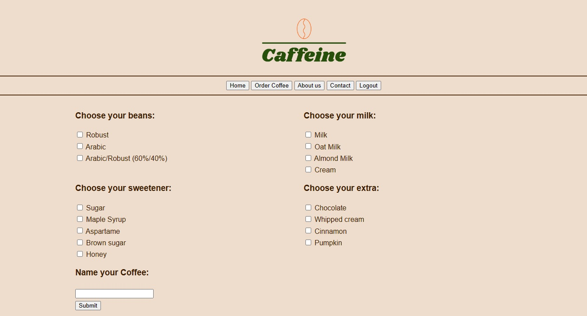

<h1>☕ Caffeine App ☕</h1>

This is portoflio application. Web application for ordering coffee. Besides basics like order form I'm going to implement User Accounts and Payments using Spring Security.
 
Application in progress.
 
 

 
Status for now: 
- ordering coffee form, 
- appending order for another coffees, 
- delivery data form,
- connection with database via SpringBootJPA,
- Login and registration, login via Github (OAuth2).
- Rest API (in progress)
- front-end (in progress)
 
 

 
<i>In folder <b>Other_Versions_For_Excercise</b> I'm adding (as the name suggests) other versions write for excercise purpose (e.g. connection with MongoDB instead of SQL db).

